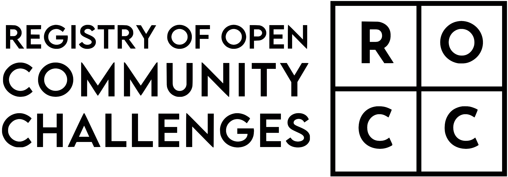
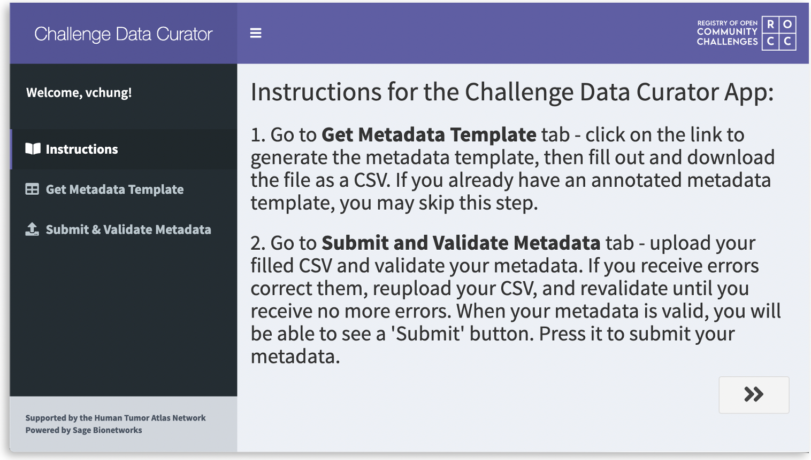

<h1 align="center">
   
  
    
  Challenge Data Curator
   
</h1>

<h4 align="center">
  A Shiny app to add and update challenge metadata on <a href="https://www.synapse.org/#!Synapse:syn22360302/" target="_blank">Synapse</a>.
</h4>

  
  
  

   

  >> <em>Access the Shiny app <a href="https://shinypro.synapse.org/users/vchung/ROCC_data_curator/" target="_blank">here</a></em> <<

### Acknowledgements
Challenge Data Curator would not be possible without the incredible **Informatics and Biocomputing team at Sage Bionetworks** :star2: This app is heavily based on their [HTAN Data Curator app](https://shiny.synapse.org/users/spatil/HTAN_data_curator/) ([source](https://github.com/Sage-Bionetworks/HTAN_data_curator)).

