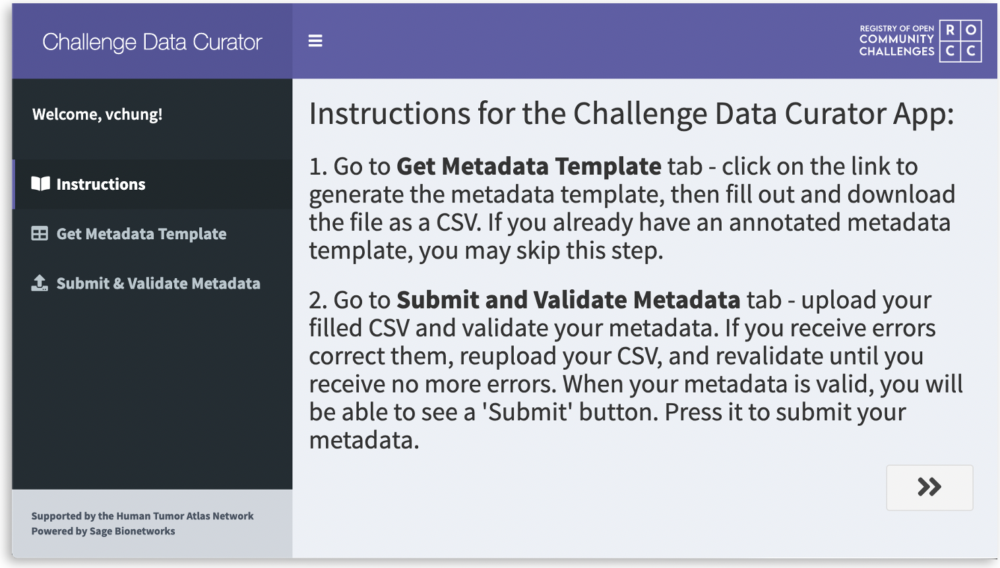

<h1 align="center">
   
  
    
  Challenge Data Curator
   
</h1>

<h4 align="center">
  A Shiny app prototype to add and update challenge metadata on <a href="https://www.synapse.org/#!Synapse:syn22360302/" target="_blank">Synapse</a>.
</h4>

  
  
  

    
  

## Usage
#### [Challenge Data Curator](https://shinypro.synapse.org/users/vchung/ROCC_data_curator/)

Before accessing the app, you must be logged into [Synapse](https://www.synapse.org) first. If you do not have an account yet, create one [here](https://www.synapse.org/#!RegisterAccount:0).

Instructions on how to add/modify challenge metadata is available on the app.

## :star2: Acknowledgements
**Challenge Data Curator** would not be possible without the incredible work of the Informatics and Biocomputing team at Sage Bionetworks and the efforts toward the Human Tumor Atlas Network (HTAN) grant. This app is heavily based on the [HTAN Data Curator app](https://shiny.synapse.org/users/spatil/HTAN_data_curator/) ([source](https://github.com/Sage-Bionetworks/HTAN_data_curator)).

#### See also:
* [Waiter](https://shiny.john-coene.com/waiter/) - loading screens for Shiny
* [Animizer](https://icons8.com/animizer/en/animate-static-image) - create GIF from a static image

